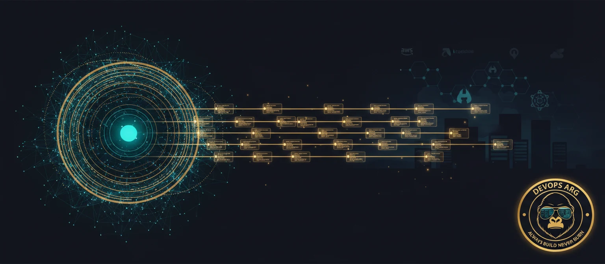
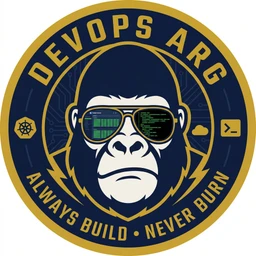

<!-- Wide cinematic hero banner — agentic AI across multi-cloud infrastructure -->

  

<h1 align="center">We build autonomous AI agents that run your infrastructure</h1>

  <em>Infrastructure that fixes itself. MTTR from 45 minutes to 3. Deploys on Fridays.</em>

  

  
  
  
  

  <code>150+ projects shipped</code> · <code>$2.1M+ cloud costs saved</code> · <code>99.99% uptime delivered</code> · <code>~3 min avg MTTR</code> · <code>2,400+ incidents auto-resolved</code>

---

## 🤖 Agentic AI is the main act

We build **autonomous AI agents** that monitor, diagnose, and remediate infrastructure — without a human on the other end. Agents that write RCAs after an incident closes. Agents that flag oversized instances inside a Terraform PR. Deploy copilots that score release risk from the diff and historical rollback rate. Chat interfaces that replace Cost Explorer.

Humans govern policy. Machines do the rest.

### How we build agents (the stack)

| Layer | What it does | What we use |
|-------|--------------|-------------|
| **Reasoning** | Multi-round agentic loops with reflection — not single-shot prompts. The agent plans, calls tools, checks, re-plans, up to N rounds with a hard cap. | Claude · CrewAI · LangGraph |
| **Knowledge** | RAG over runbooks, postmortems, Slack threads, incident timelines, IaC modules. | Qdrant · pgvector · embeddings |
| **Observability** | Eyes and ears — agents need telemetry to reason. | OpenTelemetry · Prometheus · Grafana · Datadog |
| **Execution** | Concrete tools the agent calls: AWS/GCP/Azure APIs, `kubectl`, Terraform, GitHub Actions triggers. | boto3 · k8s SDK · IaC CLIs |
| **Guardrails** | Read-only IAM by construction, policy-as-code on every action, human-in-the-loop for destructive ops. | AWS managed policies · OPA · approval gates |

### The pattern behind every agent we ship

1. Dedicated **read-only identity** per agent — the setup script verifies writes are rejected before we proceed.
2. **Tool registry** with typed schemas — every capability is an explicit function with a description; the LLM picks from the list.
3. **Multi-round loop** with a reflection step asking *"do we have enough data?"* — catches half-baked answers before they reach the user.
4. **Mock/demo mode** — every agent ships with a fictional profile so you can pitch it without connecting a live account.
5. **Streaming trace panel** — the user sees each tool call, each result, each intermediate thought. No spinner theater.

---

## 🔥 Featured projects

<table>
  <tr>
    <td width="50%" valign="top">
      <h3>🧮 <a href="https://github.com/devops-arg/finops-agent">finops-agent</a></h3>
      
<strong>Conversational FinOps agent.</strong> Chat with your AWS account in plain English. Multi-round reasoning with Claude, 15 tool handlers across Cost Explorer / EC2 / RDS / EKS / Cost Optimization Hub. Ships with a <code>create-read-only.sh</code> that provisions a dedicated IAM user and <em>verifies writes are blocked</em>.

      

        
        
        
        
        
      

      
      
<a href="https://www.devopsarg.com/en/blog/ai-finops-chat-your-aws-account/">→ Read the case study</a>

    </td>
    <td width="50%" valign="top">
      <h3>🚧 Extracting next</h3>
      
These are running in client engagements — extracting and hardening into public repos.

      <ul>
        <li><strong>sre-incident-copilot</strong> — RAG-powered SRE agent with Qdrant. Ask <em>"auth-service is timing out, what did we do last time?"</em> and it pulls from indexed postmortems, runbooks, and Datadog metrics to draft a remediation plan. Case study: <a href="https://www.devopsarg.com/en/blog/rag-powered-sre-agent-gaming-company/">gaming company that cut MTTR 12x</a>.</li>
        <li><strong>ai-incident-responder</strong> — Claude-driven agent that reads PagerDuty alerts + logs + recent deploys and drafts the RCA before the human wakes up. Case study: <a href="https://www.devopsarg.com/en/blog/building-ai-incident-responder-with-claude/">2,400+ incidents auto-resolved</a>.</li>
        <li><strong>deploy-risk-scorer</strong> — pre-merge copilot that scores deployment risk from the PR diff, historical rollback rate, and blast radius.</li>
        <li><strong>cost-anomaly-explainer</strong> — correlates cost spikes with CloudTrail events to explain <em>why</em> your bill jumped.</li>
      </ul>
      
⭐ Watch the org to get notified as each repo ships.

    </td>
  </tr>
</table>

---

## ☁️ Cloud-agnostic, not cloud-locked

Our agents and platforms are designed to run wherever your workloads live. We don't evangelize a single cloud — we match architecture to the problem.

  
  
  
  

### AI & agent toolchain

  
  
  
  
  
  

### Platform & cloud-native stack

  

  
  
  
  
  
  
  
  
  
  
  

---

## 🏗 Everything else we do

Once the AI layer is in, it needs a real platform underneath. Here's the rest of what we ship:

- **Platform engineering** — Internal Developer Platforms that turn ticket-based ops into self-service golden paths. Developers click "deploy," not "open a Jira." IaC with OpenTofu, Pulumi, or Crossplane — whatever fits.
- **Kubernetes & GitOps** — self-healing clusters with Karpenter, WASM workloads at the edge, GitOps with ArgoCD + Flux. Managed clusters serving 50M+ requests/day.
- **Cloud architecture & edge** — multi-region, multi-cloud, edge-native. Event-driven on Cloudflare Workers, AWS Lambda, Azure Functions. Active-active across continents, sub-100ms latency globally.
- **DevSecOps & Zero Trust** — Sigstore for supply chain, Falco + eBPF for runtime, policy-as-code in every PR. SOC 2, ISO 27001, PCI-DSS automated. 14K+ threats blocked, 890 CVEs auto-patched across engagements.
- **FinOps & GreenOps** — real-time cost impact before every deploy. RI/SP optimization, spot orchestration, carbon-aware scheduling. **$2.1M+ saved** — your CFO becomes your biggest fan.

---

## 📚 Case studies from the field

Every post is a real engagement with real numbers. No listicles. Real YAML, real tradeoffs, honest "what we'd do differently" sections.

| Post | What happened |
|------|---------------|
| 🤖 [**We shipped an AI FinOps agent (open source)**](https://www.devopsarg.com/en/blog/ai-finops-chat-your-aws-account/) | Built a Claude-powered chat interface for AWS costs so engineers stop ignoring Cost Explorer. Live at [finops-agent](https://github.com/devops-arg/finops-agent). |
| 🎮 [**RAG-powered SRE agent**](https://www.devopsarg.com/en/blog/rag-powered-sre-agent-gaming-company/) | Gaming platform's incident copilot — Qdrant + Claude + Datadog RAG. MTTR cut 12x. |
| 🔔 [**Building an AI incident responder**](https://www.devopsarg.com/en/blog/building-ai-incident-responder-with-claude/) | Claude-driven agent that reads alerts, logs, and deploys to draft RCAs autonomously. 2,400+ incidents. |
| 🔎 [**OpenTelemetry for fintech**](https://www.devopsarg.com/en/blog/opentelemetry-distributed-tracing-fintech/) | Distributed tracing across a payments pipeline. 45-minute incident hunts → 4-minute root cause. |
| 📰 [**Predictive pre-scaling for breaking news**](https://www.devopsarg.com/en/blog/predictive-prescaling-kubernetes-breaking-news/) | News site that stopped melting at 9 AM — KEDA + Prophet forecasting. |
| 🔐 [**Blockchain security audit**](https://www.devopsarg.com/en/blog/blockchain-startup-security-audit-case-study/) | 72 findings, 3 criticals in a DeFi startup. IAM cleanup in 2 weeks. |
| 💸 [**Karpenter spot + scale-to-zero**](https://www.devopsarg.com/en/blog/karpenter-spot-scale-to-zero/) | 68% compute savings with a single node pool. Zero developer friction. |

All posts available in [English](https://www.devopsarg.com/en/blog/) and [Castellano](https://www.devopsarg.com/es/blog/).

---

## 📊 GitHub stats

  
  

---

## 🤝 Work with us

We take **a few engagements per quarter** — 4–12 week platform sprints, fractional CTO / platform-lead, or ongoing SRE retainers. **The initial infrastructure assessment is free** — no strings.

  
  
  

---

  
   
  Based in Buenos Aires. Working with teams across the Americas and EU.
   
  <strong>Always build. Never burn.</strong>

